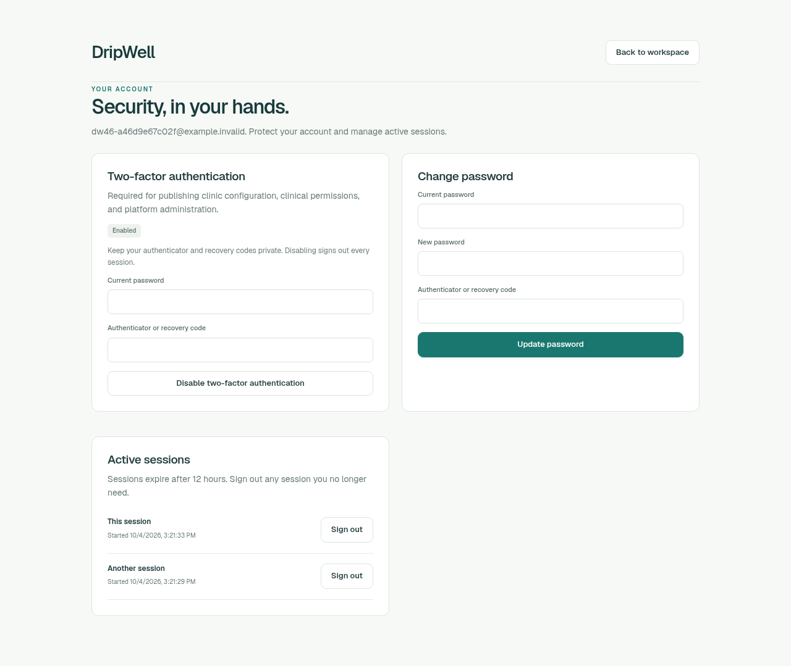

# Normal owner MFA and recovery verification

TASK-046, October 4, 2026. Actual deployed application: `80729f2f2352fa55b1e0ba911082ab52eeca8032`, tree `f61dbdd0e3e23f0988112b988e4134bc5ef5ab2b`. The protected READY Preview is `dpl_AsLremfTJcQ5ew7Cukxn3Ed7n9dJ`. Verification held documentation HEAD `10ddbf740a0cc8ff26fa2ec9fae09f4254aee6e0`, tree `96250eac1cff85c9ebb817bec5d1dc917435f6b1`, throughout. Later documentation publication is separate from application deployment.

Status: scoped API, original enabled-account image/context and actual terminal compensation independently PASS. Learning extraction is complete. TASK046 meets its scoped done criteria; exact final document review and publication follow. The full PRD section 8 pilot remains incomplete.

## What the protected application proved

One visibly fictional owner registered through the ordinary application. Registration retained clinic SUPER_USER, clinical approval false, a 14-day/10-consultation trial and zero used units. A second password login omitted the first app cookie. Both sessions were observed unrevoked immediately before MFA confirmation, so later revocation is attributable to MFA confirmation.

Password-backed enrollment returned the correct owner URI and 600-second secret contract. The real installed otplib authenticator code confirmed enrollment. The application promoted encrypted MFA state, cleared pending enrollment, produced ten recovery hashes, verified the current session and revoked the earlier session. This demonstrates usable normal encryption without reading or rotating the encryption key.

Enabled password login produced a five-minute challenge without a session cookie. One returned recovery code completed that challenge and created an ordinary verified session. Reuse against a second challenge returned `401 INVALID_MFA_CODE`, preserving that challenge, recovery count and session count. Replay of the consumed first challenge returned `410 CHALLENGE_EXPIRED`. Owner identity remained nonclinical; the platform API returned `403 PLATFORM_REQUIRED`.

The API phase used nine POSTs, six explicit GETs, 26 selected database reads, one normal project-token child and one real otplib child. No consultation, configuration, clinical-authority, model, payment or email action was part of this protocol.

## Account screen

One fresh desktop Chromium context displayed the normal `/account` page, an Enabled badge and two active sessions. The password/code fields were blank; no secret, QR or recovery codes were visible. The original 1280-by-1079 image was independently inspected. Console and page-error lists were empty. Eleven native commands and eight database reads left the API terminal rows and rates unchanged.

The exact namespace/socket closed with no active owned process. Its original PID remained an inactive zombie with the same start identity; process disappearance is not claimed. Automatic security GETs, assets and prefetch were separate from explicit API counts. The inherited context receipt timestamp is the original browser checkpoint, not a separate clock for each later source-enforced guard. No claim covers every unseen browser child. Cold desktop navigation does not establish reload, mobile, physical-device or complete network behavior.

## Cleanup and preservation

One separately authorized conditional transaction removed the nine canonical owned rows: tenant, user, location, subscription, three sessions and two challenges. It restored two exact preexisting rate versions and deleted three proven new buckets. Seven reads and one transaction, eight selected HTTPS responses, returned successfully. The original full 50-table maps, 32 rows and seven raw rate rows were restored before four individually guarded cookie/config files were removed. Four preexisting jobs, two expired recordings, ten migration rows and the original mixed cookie remained intact. Source and browser-context closure passed.

Ownership, rate and full-table checkpoints were separate reads; no single atomic snapshot across the protocol is claimed. Each full50 map came from one SQL statement. Preexisting affected-table subset equality was asserted by reviewed source, with raw response hashes retained; separate raw subset payloads were not retained. Selected field redaction and hashes do not reconstruct the discarded sensitive responses. No password, enrollment secret, code, challenge credential or project token was copied into public evidence. Outer entry output was combined and empty; separate raw stdout/stderr and subsecond outer completion clocks are unavailable.

## Review and learning

Independent source/tool review `d28d6a9a`, actual 22 inert-contract outcomes `14092c1e`, selected preflight `7be7354e`, actual API `5c54bc87`, original account image/context `34e7d82b` and exact compensation bindings `073f2eef` passed. Actual terminal compensation independently passed `fb4ad9ce`; private learning extraction `a49a5d59` is complete. P-025 records controlled session/recovery attribution; G-020 records the external Root authorization boundary. One G-019 recurrence preserves the typed reporting failures. No new distinct lesson or inferred Seen counter was added.

Root once-GO records and actual role handoffs supplied operator authority. The frozen helper's predecessor checker verifies listed descriptors and task/PASS fields; it does not enforce genuine independent-review provenance or complete membership itself. Root checked genuine returned reviews and actual required membership before each acceptance. Pure ownership predicates are not evidence of database locking or execution; the later actual operation provides that scoped proof.

A Root metadata collector first guessed a nonexistent preflight filename and stopped before authorization; correction used already-saved typed membership. The compensation evidence reporters separately made three wrapper/schema assumptions and one failed failure-recorder command. Their failures remain immutable. Only saved metadata projection was corrected; no login, browser, SQL, compensation or passing test was repeated. A tool-review terminal-newline comparison error was likewise corrected against exact saved AST bytes. These are reporting limits, not reclassified successful application failures.

Enrollment TOTP and recovery/challenge single-use are established. Fresh authenticator sign-in/replay, physical devices, clinical activation/rollback, ordinary consultation starts, trial concurrency, AI output, sharing/PDF and actual paid referral remain separate requirements. Protected Preview and literal `ALLOW_REAL_CLIENT_DATA=false` remain. The open-source Vercel Plugin 0.53.0 guidance and installed version-matched framework documentation were used; no hosted Vercel Agent or installed harness hooks are claimed.

Next is the default-disabled bounded DB maintenance coordinator. Actual compiled recurrence and Blob deletion/adoption require separate tasks and evidence. Continuous mode and hourly continuation remain enabled; a schedule is not an uninterrupted background worker.
