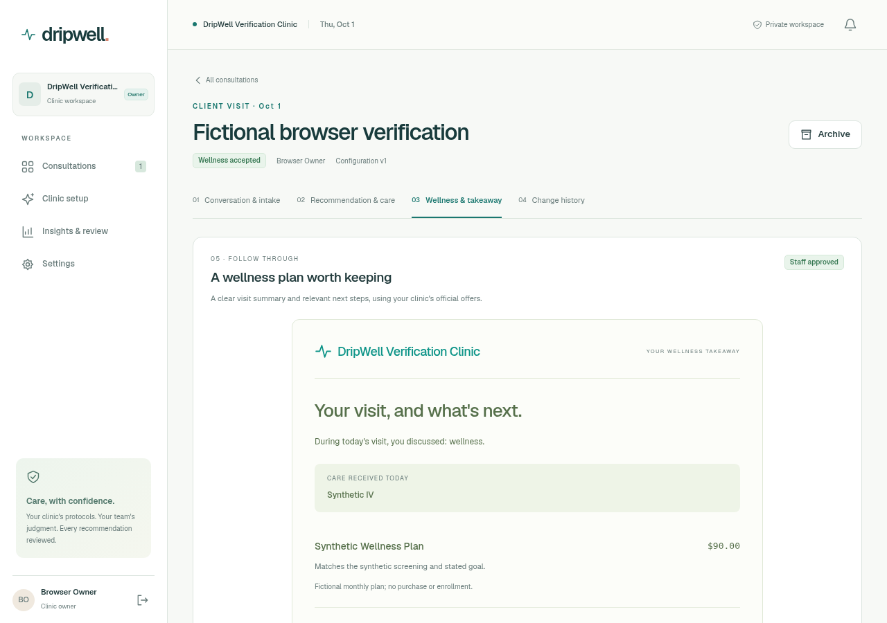
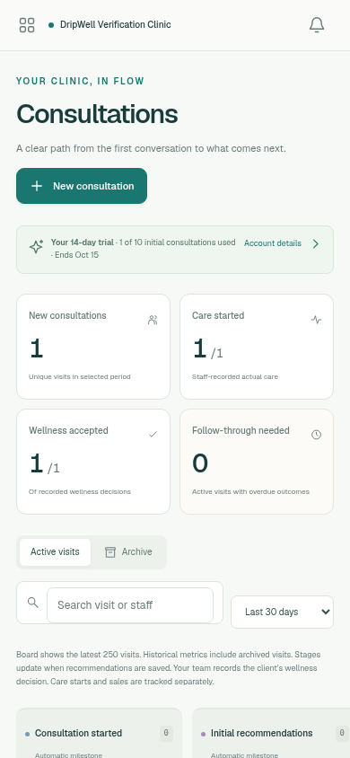
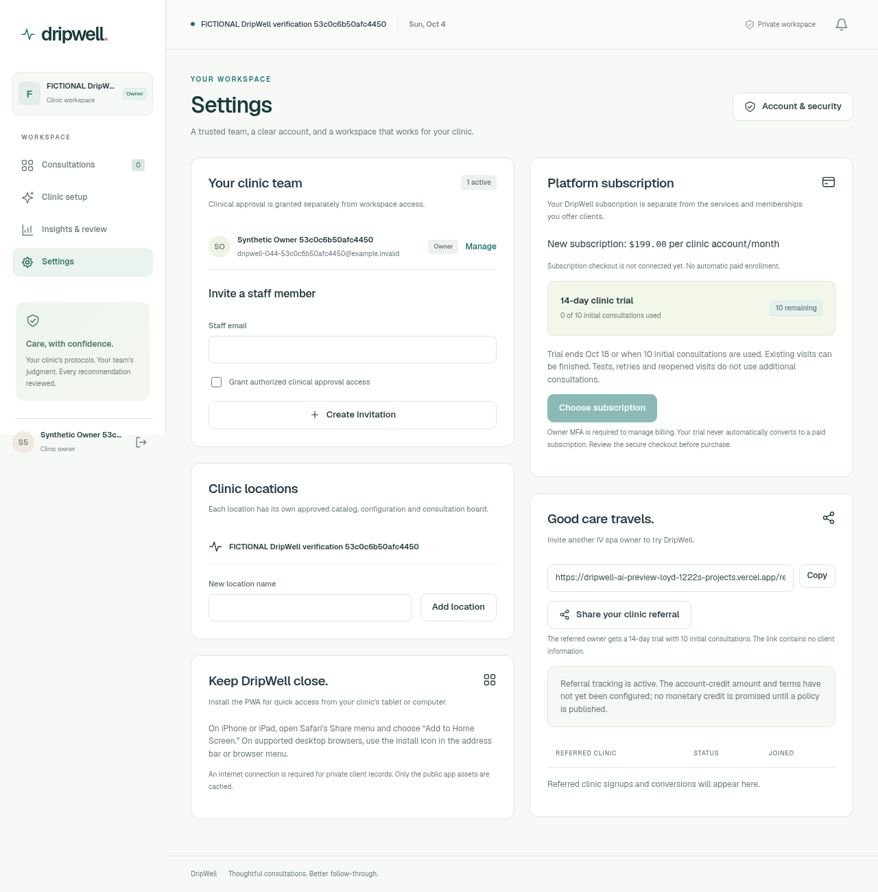
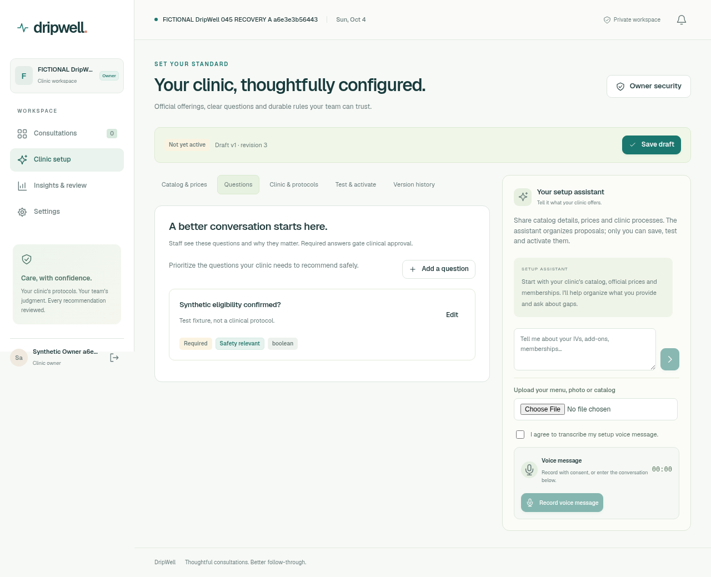
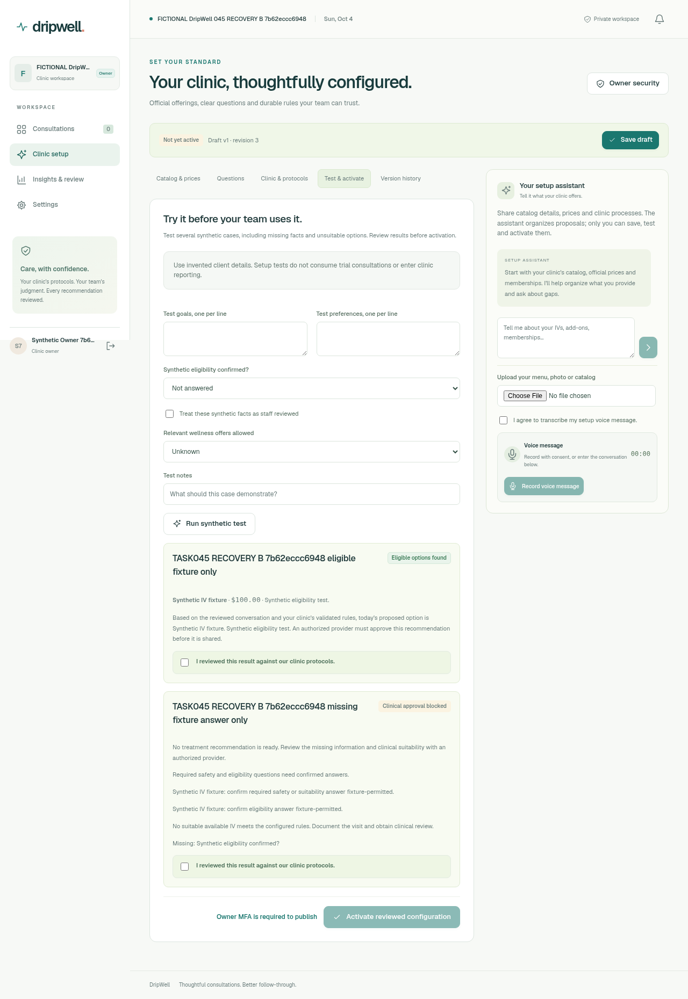

# DripWell v2 screens

These screenshots come from the running application using an explicitly fictional verification clinic. They show synthetic records, not a real patient, treatment, sale or production deployment.

## Reviewed wellness takeaway

The approved document shows the visit summary, actual-care record and catalog-priced future offer. Staff approval and the client's decision remain separate. Download and verified-recipient sharing controls appear below it.

## Mobile consultation board

The mobile workspace shows the trial allowance and care/decision metrics above the six-stage board. The board scrolls within the page; the page itself fits the device width.

See [verification evidence](VERIFICATION_REPORT.md) for checks and the remaining live-service boundary.

## Actual protected owner settings, October4,2026

This screen was captured from the current protected Preview using one normally registered fictional clinic owner. It shows the USD199 per clinic-account monthly offer,14-day trial with0of10initial consultations used/10remaining, disabled checkout/noautomatic paid enrollment and inactive referral-credit policy. No client data or clinical recommendation is shown. Independent actual screenshot/DOM reviewef5b5138 and exact account/input cleanup review6219ca19 PASS. The task-owned account/referral code was removed; the screenshot is retained as evidence.

The screenshot is202907bytes, SHA25636844612d0d7160dfe2d3a6aea8a9820033a300f471d649379925cc0763cb5a0. This scoped screen verification does not establish trial concurrency, payment/referral completion, clinical approval or the full pilot.

## Two-clinic inactive setup, October4,2026

These four actual protected-Preview screens show two normally registered fictional clinics at application80729f2f. Both contain the same USD100 Synthetic IV fixture, visibly identified as a test rather than a clinical protocol. Questions and saved eligible/missing-answer tests are present; versions remain inactive TESTED v1/rev3, owner review unchecked and activation disabled. Independent browser reviewb5f18f02 inspected all four original-resolution images; independent cleanup7c4fdccc confirms both owners and temporary inputs were removed. Desktop Chromium evidence does not establish physical Safari/PWA or activation. See [the scoped audit](AUDIT_TWO_CLINIC_SETUP.md).

